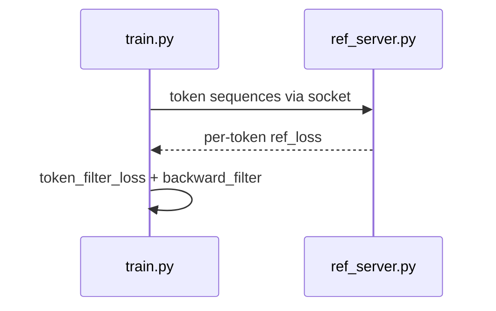

# Centrifuge

This is the implementation of [Unlocking Full Efficiency of Token Efficiency in LLM Training](https://arxiv.org/pdf/2502.00340) ICLR'26.

This work proposes an end-to-end system for making token filtering actually fast in real LLM training: it preserves utility-oriented token selection, applies activation filtering in attention backward, and rewrites the computation graph so sparse operations become efficient dimension-reduced dense operations. The result is practical training speedup while keeping model quality gains from token filtering.

For systems already using token filtering, they can be accelerated using one line of code:

```python
from grad_filter import token_filter

# After token_filter_loss(...) returns loss and ref_mask:
token_filter.ops.backward_filter(loss, ref_mask)
```

## Environment

### Build the Docker image

```bash
export DOCKER_IMAGE=tokenfilter:zero
cd docker
docker build . -t ${DOCKER_IMAGE}
```

### Start the container

Set these variables for your machine:


| Variable       | Description                                                                                                                |
| -------------- | -------------------------------------------------------------------------------------------------------------------------- |
| `HF_HOME`      | Hugging Face cache ([docs](https://huggingface.co/docs/huggingface_hub/en/package_reference/environment_variables#hfhome)) |
| `PROJECT_PATH` | Path to this repository (e.g. `$HOME/Centrifuge`)                                                                          |
| `DOCKER_IMAGE` | Image tag from the build step above                                                                                        |


```bash
export HF_HOME=/path/to/huggingface
export PROJECT_PATH=$HOME/Centrifuge
export DOCKER_IMAGE=tokenfilter:zero

docker run -it --rm --gpus all --net=host \
  -v ${HF_HOME}:/HuggingFace \
  -v ${PROJECT_PATH}:/project \
  -w /project \
  --shm-size=16g --ulimit memlock=-1 \
  --name centrifuge ${DOCKER_IMAGE} bash
```

Building the filtering operator (`grad_filter`) depends on a specific PyTorch/CUDA toolchain and compiled extensions. All paper experiments were run inside this container. For reproduction and further development, we recommend staying in the same Docker environment rather than installing dependencies on the host.

**Paper testbed (§5.1):** Ubuntu, 8× NVIDIA RTX 3090 (24GB), PyTorch 2.8.0, CUDA 12.8, BF16, gradient accumulation. Exact numbers may vary slightly with the Docker image; use comparable hardware for reproduction.

## Quickstart

Minimal path on **one GPU** with `TinyLlama/TinyLlama_v1.1`. Run inside the Docker container above.

> **HuggingFace mirror.** If direct `huggingface.co` access is blocked from your host, set
> `export HF_ENDPOINT=https://hf-mirror.com` (or pass `-e HF_ENDPOINT=https://hf-mirror.com`
> on `docker run`) before any command that loads HF models or datasets.

### Step A — Build `grad_filter`

```bash
cd grad_filter
bash build.sh
cd ..
```

### Step B — Verify the filtering operator

```bash
python gen_node_tracing.py --model_path TinyLlama/TinyLlama_v1.1 \
  --batch_size 1 --context_length 224 --filter_graph
```

A successful run executes `loss.backward()` through the compiled filter and writes
`tmp/node_tracing.txt`.

To visualize the graph (debug only, e.g. checking whether all nodes are filtered):

```bash
python gen_node_tracing.py --model_path TinyLlama/TinyLlama_v1.1 \
  --batch_size 1 --context_length 224 --filter_graph --gen_computational_graph
```

This additionally writes `tmp/computational_graph_*.svg`.

## Support More Models

New architectures follow an **offline → online** workflow (paper Fig. 7 / §C.1):


| Phase       | Tools                                                            | Purpose                                      |
| ----------- | ---------------------------------------------------------------- | -------------------------------------------- |
| **Offline** | `add_torch_native_model.py` → `build.sh` → `gen_node_tracing.py` | Build a model-specific graph-update operator |
| **Online**  | `train.py` + `--attn_filter`                                     | Apply filtering every training step          |


### 1. Probe the autograd graph

```bash
cd grad_filter
python add_torch_native_model.py --model_path <ORG/MODEL> --context_length 2048
```

This updates `target_node_names.yaml` with backward node types for the model.

Optional flags: `--use_lora`, `--attn_impl eager|sdpa|flash_attention_2`.

### 2. Regenerate and compile

```bash
bash build.sh
cd ..
```

### 3. Validate filtering

```bash
python gen_node_tracing.py --model_path <ORG/MODEL> \
  --batch_size 1 --context_length 224 --filter_graph
```

We are actively adding first-class support for more model families; the workflow above already works for any PyTorch model whose backward graph can be probed with `add_torch_native_model.py`. Stay tuned for pre-built `target_node_names.yaml` profiles for popular checkpoints.

## Reference Model

Backward token filtering uses a **reference model** to score token importance (Lin et al., 2024). For **utility reproduction (Table 1)**, we provide the full pipeline using only **public Hugging Face datasets**—no hosted copy of pre-built training data:

1. **Train** a reference model on public math instruction data (`run.sh --task train`).
2. **Build** a tokenized [Open-Web-Math](https://huggingface.co/datasets/open-web-math/open-web-math) corpus with per-token `ref_loss` (`ref_server.py` + `run.sh --task gen-data`).
3. **Fine-tune** the target model with pre-computed ref loss ([Reproduction → Table 1](#table-1--utility-tinyllama-11b-owm-50-filter)).

The commands below are the scripts for steps 1 and 2.




### Train a reference model

Use the same architecture as the target model. All datasets are public on Hugging Face.

**Single GPU (default for the README):**

```bash
export NODE_RANK=0
export INCLUDE_HOSTS=localhost:0
export MASTER=localhost

bash run.sh --task train --output_dir ref_model \
  --hosts ${INCLUDE_HOSTS} --master_addr ${MASTER} --node_rank ${NODE_RANK} \
  --master_port 18010 \
  --model_path TinyLlama/TinyLlama_v1.1 \
  --datasets meta-math/MetaMathQA,TIGER-Lab/MathInstruct,microsoft/orca-math-word-problems-200k,peiyi9979/Math-Shepherd \
  --ref_model_backend none \
  --batch_size 64 --mic_batch_size 1 --learning_rate 6e-5 \
  --context_length 2048 --add_eos_token --epochs 2
```

> **Multi-GPU (paper hyperparameters, e.g. 4 GPUs):** change `INCLUDE_HOSTS=localhost:0,1,2,3`
> and `--batch_size 512`. The same launcher works without other changes.

### Build training data with `ref_loss` (recommended)

This step constructs the dataset used for utility experiments: tokenize Open-Web-Math, run each sample through the reference model, and store `ref_loss` next to each token.

**Step 1 — Start the reference server** ([ref_server.py](ref_server.py)). On a single GPU, one process is enough:

```bash
export REF_MODEL=/HuggingFace/path/to/ref_model
# e.g., microsoft/rho-math-1b-v0.1

CUDA_VISIBLE_DEVICES=0 python ref_server.py --host 0.0.0.0 --port 8001 \
  --num_connects 1 --model_name ${REF_MODEL} --context_length 2048 &
```

> **Multi-GPU:** start one `ref_server.py` per GPU on different ports (e.g. 8001/8002/8003/8004 across `CUDA_VISIBLE_DEVICES=0/1/2/3`) and pass them all in `--ref_socket_ports` below.

**Step 2 — Run `gen-data` to attach `ref_loss`**

```bash
export NODE_RANK=0
export INCLUDE_HOSTS=localhost:0
export MASTER=localhost
export REF_SOCKET_HOSTS=localhost
export REF_SOCKET_PORTS=8001

bash run.sh --task gen-data --output_dir owm_with_ref_loss \
  --hosts ${INCLUDE_HOSTS} --master_addr ${MASTER} --node_rank ${NODE_RANK} \
  --master_port 18011 \
  --datasets open-web-math/open-web-math \
  --ref_model_backend socket \
  --ref_socket_hosts ${REF_SOCKET_HOSTS} \
  --ref_socket_ports ${REF_SOCKET_PORTS} \
  --packing_samples --context_length 2048 --add_eos_token \
  --pre_compute_ref --random_seed 4321
```

The cached output (under the run’s `data_cache_dir`, printed in logs) contains tokenized sequences plus `ref_loss`. Training with `--pre_compute_ref` reads this cache automatically when using the same `--output_dir` / cache layout.

For multi-node `gen-data`, set `--ref_socket_hosts` to `ref-node@data-node` and mirror port lists (see [Train](#train)).

## Train

All distributed jobs go through [run.sh](run.sh) → [train.py](train.py) (DeepSpeed, `--no_ssh` multi-node).

### Training modes


| Mode                          | Flags                                                            | Effect                                               |
| ----------------------------- | ---------------------------------------------------------------- | ---------------------------------------------------- |
| **Baseline**                  | `--ref_model_backend none`                                       | Standard training, no filtering                      |
| **Loss-only filtering**       | `--dropping_strategy fixed --drop_rate 0.5` (no `--attn_filter`) | Lin et al. style; utility gains, little speedup      |
| **Pre-computed ref + filter** | `--pre_compute_ref --drop_rate 0.5`                              | Mask from cached ref loss                            |
| **Full acceleration**         | above + `--attn_filter`                                          | Graph rewrite + accelerated backward (paper Table 2) |


**Default target dataset:** `open-web-math/open-web-math` (paper §5.1).

### Paper hyperparameters (§5.1)


| Setting        | Paper             | CLI                                      |
| -------------- | ----------------- | ---------------------------------------- |
| Context length | 2048              | `--context_length 2048`                  |
| Batch size     | ~1M tokens / step | `--batch_size 512` + `--packing_samples` |
| Learning rate  | 5e-5              | `--learning_rate 5e-5`                   |
| Filter ratio   | 50%               | `--drop_rate 0.5`                        |
| Target data    | Open-Web-Math     | `--datasets open-web-math/open-web-math` |


### Launch

[run.sh](run.sh) wraps `deepspeed --include=...` and runs on one or more GPUs.

**Single GPU (default for the README):**

```bash
export NODE_RANK=0
export INCLUDE_HOSTS=localhost:0
export MASTER=localhost
export BATCH_SIZE=64
export LR=5e-5
export OUTPUT_DIR=tinyllama_${BATCH_SIZE}_${LR}
```

**Baseline (no filtering):**

```bash
bash run.sh --task train --output_dir ${OUTPUT_DIR}_baseline \
  --hosts ${INCLUDE_HOSTS} --master_addr ${MASTER} --node_rank ${NODE_RANK} \
  --master_port 18012 \
  --ref_model_backend none --batch_size ${BATCH_SIZE} --learning_rate ${LR}
```

**Token filtering with acceleration:**

```bash
bash run.sh --task train --output_dir ${OUTPUT_DIR}_filtered \
  --hosts ${INCLUDE_HOSTS} --master_addr ${MASTER} --node_rank ${NODE_RANK} \
  --master_port 18013 \
  --ref_model_backend socket --pre_compute_ref \
  --dropping_strategy fixed --drop_rate 0.5 \
  --batch_size ${BATCH_SIZE} --learning_rate ${LR} \
  --add_eos_token --packing_samples --attn_filter
```


| Parameter       | Meaning                                                                      |
| --------------- | ---------------------------------------------------------------------------- |
| `--node_rank`   | Rank of this machine in the job                                              |
| `--hosts`       | DeepSpeed `--include`, e.g. `localhost:0` or `node-a:0,1,2,3@node-b:4,5,6,7` |
| `--master_addr` | Master node hostname                                                         |
| `--master_port` | Master port (`run.sh` default 8010; override with `--master_port`)           |


> **Multi-GPU / multi-node (paper hyperparameters).** Edit [configs/hostfile](configs/hostfile)
> for your cluster, then set, e.g.,
> `INCLUDE_HOSTS="node-a:0,1,2,3@node-b:0,1,2,3"`, `MASTER=node-a`, `BATCH_SIZE=512`.
> Run the same command on each node with the correct `--node_rank`. The launcher path is identical.

**LoRA:** add `--use_lora` (paper §5.3 uses rank 64 on attention projections for Llama3.2-3B).
`--use_lora` and `--attn_filter` cannot be combined under DeepSpeed ZeRO-1; see
[Known limitations](#known-limitations).

## Project Structure

```
Centrifuge/
├── grad_filter/              # C++/CUDA filtering extension
│   ├── gen.py                # Generate node_processing.cpp from torchgen
│   ├── add_torch_native_model.py  # Probe graph → target_node_names.yaml
│   ├── build.sh              # Generate + compile (use this to build)
│   └── token_filter/         # Python bindings (ops.backward_filter, ...)
├── train.py                  # DeepSpeed training + --attn_filter integration
├── gen_node_tracing.py       # Offline validation & graph visualization
├── run.sh                    # Multi-node launcher (train, gen-data, eff-benchmark)
├── arguments.py              # Shared CLI definitions
├── ref_server.py             # Reference-model socket server
├── ref_client.py             # Socket client utilities
├── efficiency_benchmark.py   # Paper efficiency experiments
├── eff.sh                    # Thin wrapper for efficiency_benchmark.py
├── model/                    # token_filter_loss, dropping masks, n-gram ref
│   └── megatronlm.py         # TP-aware Llama layers (megatron.core.tensor_parallel)
├── data/                     # Dataset tokenization & caching
├── configs/                  # hostfile, DeepSpeed / accelerate configs
├── docker/                   # Training & evaluator images
├── megatron_tp_benchmark.py  # Single-node TP efficiency benchmark
├── megatronlm/               # Experimental; future Megatron-LM TP/PP/EP integration
└── tmp/                      # Runtime outputs (gitignored)
```
